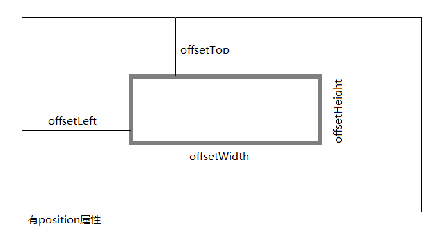
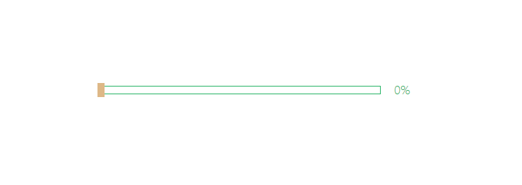
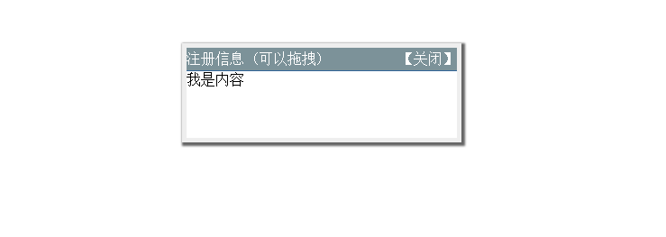
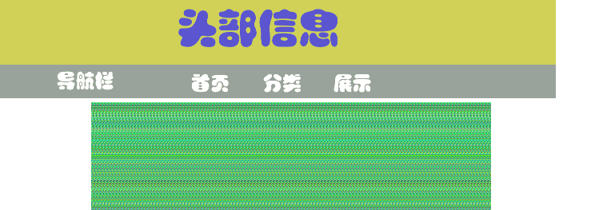

# js-effects  
一个原生js特效仓库，用来练习js基础。

关于offset系列的几点说明：

* **offsetWidth offsetHeight**

    得到对象的自身的宽度和高度
    
    ``` 
    offsetWidth =  width  + border  +  padding
     
    offsetHidth =  Height  + border  +  padding
    ```

* **offsetLeft  offsetTop**

    返回元素距离上级**有定位**父元素的左边距离和上边距离
    
* **offsetParent**

    返回元素的**有定位**父元素（不一定是亲父亲）
    
    
    *注意：返回值均为数值，不带单位*
    
    

### 1.匀速运动　　[DEMO](http://arthas.com.cn/js-effects/lesson01/index.html)  [源码](https://github.com/mohong/js-effects/blob/master/lesson01/index.html)
---


### 2.缓动动画　　[DEMO](http://arthas.com.cn/js-effects/lesson02/index.html)  [源码](https://github.com/mohong/js-effects/blob/master/lesson02/index.html)
---


### 3.焦点图　　[DEMO](http://arthas.com.cn/js-effects/lesson03/index.html)  [源码](https://github.com/mohong/js-effects/blob/master/lesson03/index.html)
---


### 4.轮播图　　[DEMO](http://arthas.com.cn/js-effects/lesson04/index.html)  [源码](https://github.com/mohong/js-effects/blob/master/lesson04/index.html)
---


### 5.获取鼠标坐标　　[DEMO](http://arthas.com.cn/js-effects/lesson05/index.html)  [源码](https://github.com/mohong/js-effects/blob/master/lesson05/index.html)
---


### 6.拖动水平条　　[DEMO](http://arthas.com.cn/js-effects/lesson06/index.html)  [源码](https://github.com/mohong/js-effects/blob/master/lesson06/index.html)
---


### 7.窗口拖动　　[DEMO](http://arthas.com.cn/js-effects/lesson07/index.html)  [源码](https://github.com/mohong/js-effects/blob/master/lesson07/index.html)
---


### 8.导航固定　　[DEMO](http://arthas.com.cn/js-effects/lesson08/index.html)  [源码](https://github.com/mohong/js-effects/blob/master/lesson08/index.html)
---
