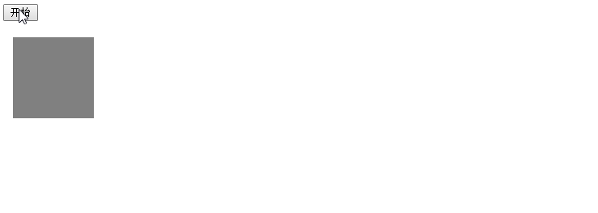

# js-effects  
一个原生js特效仓库，用来练习js基础。

### 1.匀速运动　　[DEMO](http://arthas.com.cn/js-effects/lesson01/index.html)  [源码](https://github.com/mohong/js-effects/blob/master/lesson01/index.html)
---

### 2.缓动动画　　[DEMO](http://arthas.com.cn/js-effects/lesson02/index.html)  [源码](https://github.com/mohong/js-effects/blob/master/lesson02/index.html)
---

### 3.焦点图　　[DEMO](http://arthas.com.cn/js-effects/lesson03/index.html)  [源码](https://github.com/mohong/js-effects/blob/master/lesson03/index.html)
---

### 4.轮播图　　[DEMO](http://arthas.com.cn/js-effects/lesson04/index.html)  [源码](https://github.com/mohong/js-effects/blob/master/lesson04/index.html)
---

### 5.获取鼠标坐标　　[DEMO](http://arthas.com.cn/js-effects/lesson05/index.html)  [源码](https://github.com/mohong/js-effects/blob/master/lesson05/index.html)
---

### 6.拖动水平条　　[DEMO](http://arthas.com.cn/js-effects/lesson06/index.html)  [源码](https://github.com/mohong/js-effects/blob/master/lesson06/index.html)
---

### 7.窗口拖动　　[DEMO](http://arthas.com.cn/js-effects/lesson07/index.html)  [源码](https://github.com/mohong/js-effects/blob/master/lesson07/index.html)
---

### 8.导航固定　　[DEMO](http://arthas.com.cn/js-effects/lesson08/index.html)  [源码](https://github.com/mohong/js-effects/blob/master/lesson08/index.html)
---
